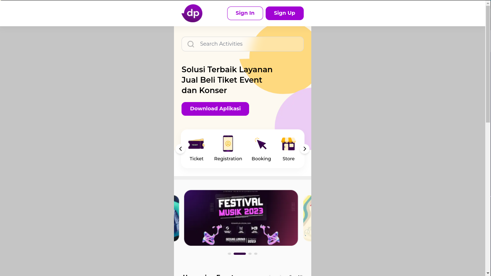

# DEPUBLIC PROJECT

## CODING CHALLENGE PROJECT BASED SMKDEV Community - FRONT END



### **LINK URL WEBSITE** : https://depublic-pwa.vercel.app/

## MAIN OF TECHNOLOGY : [NEXTJS 13.5.6](https://github.com/flowbite/flowbite-react)

## Project Dependencies List

Here is a list of dependencies used in this project, along with links to their official documentation:

1. [Redux Toolkit](https://redux-toolkit.js.org/): A library for state management and actions in React applications.

2. [Firebase](https://firebase.google.com/): A development platform for mobile and web applications by Google.

3. [Flowbite](https://github.com/flowbite/flowbite): A lightweight UI framework for web development.

4. [Flowbite React](https://github.com/flowbite/flowbite-react): React components that align with Flowbite.

5. [Next.js](https://nextjs.org/): A React framework for web application development.

6. [Next PWA](https://github.com/shadowwalker/next-pwa): Next.js plugin for Progressive Web App (PWA) support.

7. [React](https://react.dev): A JavaScript library for building user interfaces.

8. [React DOM](https://reactjs.org/docs/react-dom.html): The library used to integrate React with the DOM.

9. [React Icons](https://react-icons.github.io/react-icons/): A collection of React icons that can be used in your project.

10. [React Redux](https://react-redux.js.org/): The library used to integrate Redux with React applications.

11. [Swiper](https://swiperjs.com/): A powerful slider and carousel library for web applications.

## Development Dependencies

Here is a list of development dependencies used in this project:

1. [Autoprefixer](https://github.com/postcss/autoprefixer): A PostCSS plugin for automatically adding CSS prefixes.

2. [ESLint](https://eslint.org/): Tool for analyzing your JavaScript code and finding potential issues.

3. [ESLint Config Next](https://github.com/vercel/next.js/tree/canary/packages/eslint-config-next): ESLint configuration for Next.js projects.

4. [PostCSS](https://postcss.org/): A tool for processing CSS code with JavaScript.

5. [React Toastify](https://fkhadra.github.io/react-toastify/introduction): An easy-to-use toast notification component for React.

6. [Tailwind CSS](https://tailwindcss.com/): A CSS framework that allows you to quickly build web layouts using pre-existing CSS classes.


### Overview of Website Workflow

The following steps outline the workflow of the "Depublic" website:

1. **Access the Website**: Open your web browser and enter the URL [https://depublic-pwa.vercel.app](https://depublic-pwa.vercel.app) in the address bar.

2. **Loading Screen**: Upon entering the website, a loading screen will be displayed. This loading screen ensures that all website components are fully rendered before the content becomes visible.

3. **Homepage Content**: Once the loading process is complete, you will be able to view the contents of the homepage. Explore the website's offerings and get a general overview of the available features and events.

4. **User Registration and Login**:
    - To access detailed event information and make bookings, you need to register or log in.
    - Use the "Sign In" or "Sign Up" buttons in the navigation bar at the top of the website to initiate the registration or login process.
    - Alternatively, you can use the "Sign In with Google" option by clicking the Google icon located below the sign-in and sign-up forms.

5. **Access Detailed Event Information**: After successfully logging in, you will gain access to detailed event information, including event details and the ability to purchase event tickets or place orders.

Feel free to follow these steps to navigate and explore the "Depublic" website efficiently. If you encounter any issues or have questions, please don't hesitate to reach out. Enjoy your experience on the platform!


### Project Structure - Depublic

1. **app** (Main Next.js Application Folder)
   - This is the main folder for the Next.js application. It contains various files and subfolders used for routing and managing the application.

2. **components**
   - This folder contains reusable React components used throughout the application. Components are grouped based on their purpose and can include custom components such as buttons, navigation bars, footers, and more.

3. **context**
   - This folder is responsible for managing global state using React Context. It includes the following files:
     - `AuthContext.js`: Manages global state for user authentication, including login and registration.
     - `TicketContext.js`: Manages global state for event ticket data.
     - `BlogContext.js`: Manages global state for blog-related data.

4. **node_modules**
   - This directory contains all the libraries and modules installed by the package manager (e.g., npm or yarn) to be used in the project.

5. **public**
   - The `public` folder stores various files and assets supporting the website. This includes image assets and the web manifest for Progressive Web App (PWA) functionality.

6. **readme-images**
   - This folder contains images that can be included in the README documentation for visual aid.

7. **styles**
   - The `styles` folder holds the `globals.css` file, which is responsible for styling all pages of the website globally.

8. **env**
   - This folder is used to store environment variables securely. It typically contains sensitive data such as API keys or URLs. In a production environment, these variables are managed separately, separate from the GitHub repository.

9. **.eslintrc.json**
   - The ESLint configuration file, which defines linting rules, plugins, and other options for maintaining code quality in the JavaScript project.

10. **.gitignore**
    - This file specifies which files and directories should be ignored by Git, ensuring that sensitive or irrelevant files are not included in version control.

11. **jsconfig.json**
    - A configuration file for enabling better TypeScript and JavaScript tooling within the project.

12. **next.config.js**
    - Configuration for Next.js, including options and settings for the Next.js framework.

13. **package.json**
    - The package.json file includes information about the project, such as the title, description, version, scripts, and dependencies required by the project.

14. **pnpm-lock.yaml**
    - The pnpm lock file containing information about package versions and their dependencies.

15. **postcss.config.js**
    - Configuration file for PostCSS, used for processing CSS code in the project.

16. **README.md**
    - The documentation file for the project, providing information about the project structure, features, and usage.

17. **tailwind.config.js**
    - Configuration file for Tailwind CSS, a utility-first CSS framework used in the project.


### Installing Modules and Running This Project
1. Check npm version for already installed
    ```
    npm --version
    ```
2. Global installing pnpm for package manager
    ```
    npm install -g pnpm
    ```
3. Install modules with pnpm
    ```
    pnpm install
    ```
4. Running this project on localhost:3000 for development mode
    ```
    pnpm run dev
    ```
5. Running this project on localhost:3000 for production mode
    ```
    pnpm run start
    ```
6. If you want to build this project
    ```
    pnpm run build
    ```

### How to use

1. Open git bash or CMD for windows (I recommend git bash) or terminal (Linux OS)
2. Copy url of github repository, write this command "git clone https://github.com/KarMint26/depublic.git" in the directory that you want, for example in Documents or Downloads
2. After cloning is done, go to project directory with "cd" command, for example "cd Documents/depublic"
3. if pnpm is already installed, write command "pnpm install && pnpm run dev", but if not installed please install pnpm first with command "npm install -g pnpm" for globally install
4. After the vite server running on your local computer, you have already to open the browser and write url "localhost:3000" for seeing the lookup of this project

### Features and Advantages:

1. Progressive Web App (PWA)
   - Depublic is a Progressive Web App, allowing users to install it on their devices, access it offline, and enjoy a smooth browsing experience. 

2. Responsive Design
   - The web application is responsive, catering to various screen sizes (small, medium, and large) on mobile devices, tablets, and desktops. The layout adapts to provide an optimal viewing experience.

3. Next.js for CSR and SSR
   - Next.js is used to implement both Client-Side Rendering (CSR) and Server-Side Rendering (SSR). This enhances performance and SEO while maintaining a dynamic frontend.

4. Firebase Authentication
   - Depublic leverages Firebase for user authentication, offering secure and hassle-free login and registration processes for users.

5. React Context API
   - The project employs React's Context API for global state management, making it easy to share and manage data across various components in the application.

6. Modern and Harmonious Design
   - Depublic features a visually appealing and modern design with carefully chosen colors, providing a pleasant and harmonious visual experience for users.

7. Error Handling
   - Depublic implements robust error handling to ensure a seamless user experience. It gracefully handles and displays error messages, providing users with clear guidance when issues arise.

8. Loading Screens
   - Loading screens are utilized to enhance user experience while rendering route pages. These screens keep users engaged while content is being loaded, contributing to a polished and professional look and feel.

9. Authentication Form Validation
   - Both the login and registration forms feature input validation, ensuring that users enter valid data. This helps prevent common user errors and offers a smooth registration and login process.
